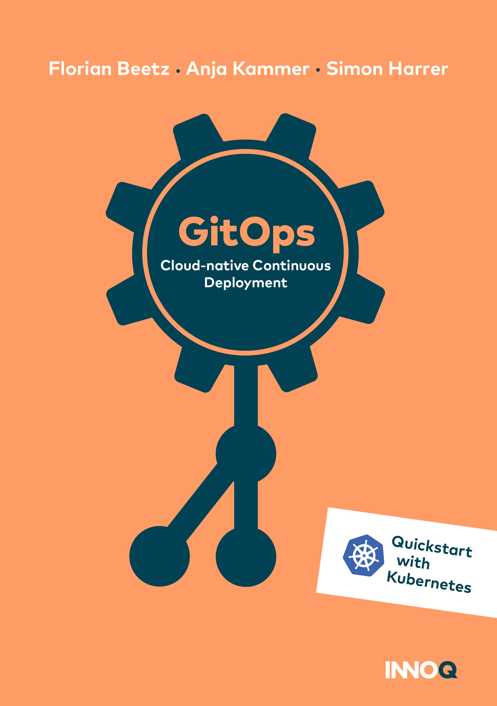
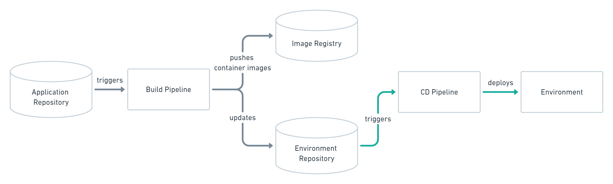
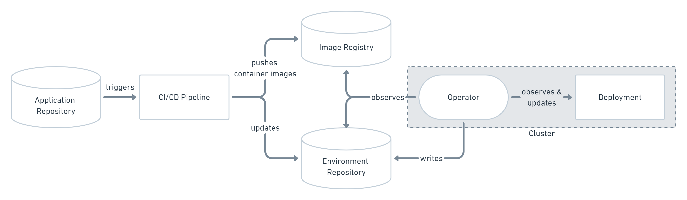
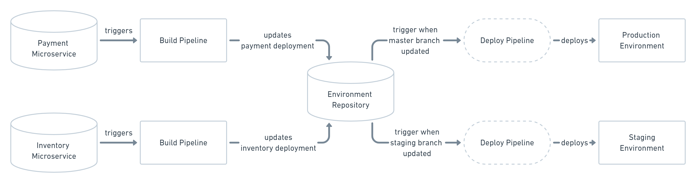

# GitOps

Since its inception in 2017 by [Weaveworks](https://www.weave.works/technologies/gitops/), GitOps has caused quite some fuss on Twitter and KubeCon.
This site aggregates the essence of GitOps to help clear up the confusion about the topic.

---

[{:height="300px"}](https://leanpub.com/gitops/c/release-50-for-50-website)

We've written a short book on GitOps. Get it as a [free PDF or ePub](https://leanpub.com/gitops), or for a small fee as a [Kindle eBook](https://www.amazon.com/gp/product/B098GSX42P/) or [paperback](https://www.amazon.com/gp/product/3982112680/).

---

## What is GitOps?

GitOps is a way of implementing Continuous Deployment for cloud native applications.
It focuses on a developer-centric experience when operating infrastructure, by using tools developers are already familiar with, including Git and Continuous Deployment tools.

The core idea of GitOps is having a Git repository that always contains declarative descriptions of the infrastructure currently desired in the production environment and an automated process to make the production environment match the described state in the repository.
If you want to deploy a new application or update an existing one, you only need to update the repository - the automated process handles everything else.
It's like having cruise control for managing your applications in production.

> GitOps: versioned CI/CD on top of declarative infrastructure. Stop scripting and start shipping.
>
> &mdash; [Kelsey Hightower](https://twitter.com/kelseyhightower/status/953638870888849408)

## Why should I use GitOps?

### Deploy Faster More Often

Okay, to be fair, probably every Continuous Deployment technology promises to make deploying faster and allows you to deploy more often.
What is unique about GitOps is that you don't have to switch tools for deploying your application.
Everything happens in the version control system you use for developing the application anyways.

> When we say “high velocity” we mean that every product team can safely ship updates many times a day &mdash; deploy instantly, observe the results in real time, and use this feedback to roll forward or back.
>
> &mdash; [Weaveworks](https://www.weave.works/blog/gitops-high-velocity-cicd-for-kubernetes)

### Easy and Fast Error Recovery

Oh no! Your production environment is down!
With GitOps you have a complete history of how your environment changed over time.
This makes error recovery as easy as issuing a `git revert` and watching your environment being restored.

> The Git record is then not just an audit log but also a transaction log. You can roll back & forth to any snapshot.
>
> &mdash; [Alexis Richardson](https://twitter.com/monadic/status/1002502644798238721)

### Easier Credential Management

GitOps allows you to manage deployments completely from inside your environment.
For that, your environment only needs access to your repository and image registry.
That's it.
You don't have to give your developers direct access to the environment.

> kubectl is the new ssh. Limit access and only use it for deployments when better tooling is not available.
>
> &mdash; [Kelsey Hightower](https://twitter.com/kelseyhightower/status/1070413458045202433)

### Self-documenting Deployments

Have you ever SSH'd into a server and wondered what's running there?
With GitOps, every change to any environment must happen through the repository.
You can always check out the master branch and get a complete description of what is deployed where plus the complete history of every change ever made to the system.
And you get an audit trail of any changes in your system for free!

### Shared Knowledge in Teams

Using Git to store complete descriptions of your deployed infrastructure allows everybody in your team to check out its evolution over time.
With great commit messages everybody can reproduce the thought process of changing infrastructure and also easily find examples of how to set up new systems.

> GitOps is the best thing since configuration as code. Git changed how we collaborate, but declarative configuration is the key to dealing with infrastructure at scale, and sets the stage for the next generation of management tools.
>
> &mdash; [Kelsey Hightower](https://twitter.com/kelseyhightower/status/1164192321891528704)

## How does GitOps work?

## Environment Configurations as Git repository
GitOps organizes the deployment process around code repositories as the central element.
There are at least two repositories: the application repository and the environment configuration repository. The application repository contains the source code of the application and the deployment manifests to deploy the application.
The environment configuration repository contains all deployment manifests of the currently desired infrastructure of an deployment environment. It describes what applications and infrastructural services (message broker, service mesh, monitoring tool, ...) should run with what configuration and version in the deployment environment.

## Push-based vs. Pull-based Deployments

There are two ways to implement the deployment strategy for GitOps: Push-based and Pull-based deployments.
The difference between the two deployment types is how it is ensured, that the deployment environment actually resembles the desired infrastructure. When possible, the Pull-based approach should be preferred as it is considered the more secure and thus better practice to implement GitOps.

### Push-based Deployments

The Push-based deployment strategy is implemented by popular CI/CD tools such as [Jenkins](https://jenkins.io/), [CircleCI](https://circleci.com/), or [Travis CI](https://travis-ci.org/).
The source code of the application lives inside the application repository along with the Kubernetes YAMLs needed to deploy the app.
Whenever the application code is updated, the build pipeline is triggered, which builds the container images and finally the environment configuration repository is updated with new deployment descriptors.

Tip: You can also just store templates of the YAMLs in the application repository.
When a new version is built, the template can be used to generate the YAML in the environment configuration repository.

Changes to the environment configuration repository trigger the deployment pipeline.
This pipeline is responsible for applying all manifests in the environment configuration repository to the infrastructure. With this approach it is indispensable to provide credentials to the deployment environment. So the pipeline has god-mode enabled. In some use cases a Push-based deployment is inevitable when running an automated provisioning of cloud infrastructure. In such cases it is strongly recommended to utilize the fine-granular configurable authorization system of the cloud provider for more restrictive deployment permissions.

Another important thing to keep in mind when using this approach is that the deployment pipeline *only* is triggered when the environment repository changes.
It can not automatically notice any deviations of the environment and its desired state.
This means, it needs some way of monitoring in place, so that one can intervene if the environment doesn't match what is described in the environment repository.

**Want to see how to set it up?** Check out [Google's Tutorial](https://cloud.google.com/kubernetes-engine/docs/tutorials/gitops-cloud-build) on how to set up Push-based deployments with their Cloud Builds and GKE.

### Pull-based Deployments

The Pull-based deployment strategy uses the same concepts as the push-based variant but differs in how the deployment pipeline works. Traditional CI/CD pipelines are triggered by an external event, for example when new code is pushed to an application repository.
With the pull-based deployment approach, the *operator* is introduced.
It takes over the role of the pipeline by continuously comparing the desired state in the environment repository with the actual state in the deployed infrastructure.
Whenever differences are noticed, the operator updates the infrastructure to match the environment repository. Additionally the image registry can be monitored to find new versions of images to deploy.

Just like the push-based deployment, this variant updates the environment whenever the environment repository changes.
However, with the operator, changes can also be noticed in the other direction.
Whenever the deployed infrastructure changes in any way not described in the environment repository, these changes are reverted.
This ensures that all changes are made traceable in the Git log, by making all direct changes to the cluster impossible.

This change in direction solves the problem of push-based deployments, where the environment is only updated when the environment repository is updated.
However, this doesn't mean you can completely do without any monitoring in place.
Most operators support sending mails or Slack notifications if it can not bring the environment to the desired state for any reason, for example if it can not pull a container image.
Additionally, you probably should set up monitoring for the operator itself, as there is no longer any automated deployment process without it.

The operator should always live in the same environment or cluster as the application to deploy. This prevents the god-mode, seen with the push-based approach, where credentials for doing deployments are known by the CI/CD pipeline. When the actual deploying instance lives inside the very same environment, no credentials need to be known by external services. The Authorization mechanism of the deployment platform in use can be utilized to restrict the permissions on performing deployments. This has a huge impact in terms of security. When using Kubernetes, RBAC configurations and service accounts can be utilized.

---

**Want to see how to set it up?** Check out our [Tutorial about setting up Pull-based GitOps on Google's GKE with WeaveWorks Flux](tutorial.md).

---

### Working with Multiple Applications and Environments

Of course working with just one application repository and only one environment is not realistic for most applications.
When you are using a microservices architecture, you probably want to keep each service in its own repository.

GitOps can also handle such a use case.
You can always just set up multiple build pipelines that update the environment repository.
From there on the regular automated GitOps workflow kicks in and deploys all parts of your application.

Managing multiple environments with GitOps can be done by just using separate branches in the environment repository.
You can set up the operator or the deployment pipeline to react to changes on one branch by deploying to the production environment and another to deploy to staging.

## FAQ

### Is my project ready for GitOps?

Most likely: Yes!
The cool thing about GitOps is that you don't need to write any code differently.
All you need to get started is infrastructure that can be managed with declarative Infrastructure as Code tools.

### I don't use Kubernetes. Can I still use GitOps?

Yes! GitOps is not limited to Kubernetes.
In principle, you can use any infrastructure that can be observed and described declaratively, and has Infrastructure as Code tools available.
However, currently most operators for pull-based GitOps are implemented with Kubernetes in mind.

### Is GitOps just versioned Infrastructure as Code?

> Is GitOps just a new name for Infra as Code?
>
> &mdash; [sholom](https://twitter.com/sholom/status/1173613576696795136)

No. Declarative Infrastructure as Code plays a huge role for implementing GitOps, but it's not just that.
GitOps takes the whole ecosystem and tooling around Git and applies it to infrastructure.
Continuous Deployment systems guarantee that the currently desired state of the infrastructure is deployed in the production environment.
Apart from that you gain all the benefits of code reviews, pull requests, and comments on changes for your infrastructure.

### How to get secrets into the environment without storing them in git?

First of all, never store secrets in plain text in git! Never!

That being said, you have secrets created within the environment which never leave the environment. The secret stays unknown, and applications get the secrets they require but they aren't exposed to the outside world. For example, you provision a database within the environment and give the secret to the applications interacting with the database only.

Another approach is to add a private key once to the environment (probably by someone from a dedicated ops team) and from that point you can add secrets encrypted by the public key to the environment repository. There's even tool support for such [sealed secrets](https://github.com/bitnami-labs/sealed-secrets) in the K8s ecosystem.

### How does GitOps Handle DEV to PROD Propagation?

GitOps doesn't provide a solution to propagating changes from one stage to the next one.
We recommend using only a single environment and avoid stage propagation altogether.
But if you need multiple stages (e.g., DEV, QA, PROD, etc.) with an environment for each, you need to handle the propagation outside of the GitOps scope, for example by some CI/CD pipeline.

### We are already doing DevOps. What's the difference to GitOps?

DevOps is all about the cultural change in an organization to make people work better together.
GitOps is a technique to implement Continuous Delivery.
While DevOps and GitOps share principles like automation and self-serviced infrastructure, it doesn't really make sense to compare them.
However, these shared principles certainly make it easier to adopt a GitOps workflow when you are already actively employing DevOps techniques.

### So, is GitOps basically NoOps?

You can use GitOps to implement NoOps, but it doesn't automatically make all operations tasks obsolete.
If you are using cloud resources anyway, GitOps can be used to automate those.
Typically, however, some part of the infrastructure like the network configuration or the Kubernetes cluster you use isn't managed by yourself decentrally but rather managed centrally by some operations team.
So operations never really goes away.

### Is there also SVNOps?

In a way, yes.
In principle, you can use any version control system you want.
One of the core ideas of GitOps is letting developers use the tools they are familiar with to operate your infrastructure.
If you prefer SVN over Git, that's cool!
However, you may need to put more effort into finding tools that work for you or even write your own.
All available operators only work with Git repository &mdash; sorry!

### Should I hire GitOps engineers for my team now?

No! There are no GitOps engineers. GitOps is not a role (and neither is DevOps).
GitOps is a set of practices. You can look for a developer who has experience practicing GitOps &mdash; or simply let your developers try out those practices.

## Tools, Articles, and Talks

### Tools

* [ArgoCD](https://argoproj.github.io/argo-cd/): A GitOps operator for Kubernetes with a web interface
* [Flux](https://github.com/fluxcd/flux): The GitOps Kubernetes operator by the creators of GitOps &mdash; [Weaveworks](https://www.weave.works/technologies/gitops/)
* [Gitkube](https://gitkube.sh): A tool for building and deploying docker images on Kubernetes using `git push`
* [JenkinsX](https://jenkins-x.io/): Continuous Delivery on Kubernetes with built-in GitOps
* [Terragrunt](https://github.com/gruntwork-io/terragrunt): A wrapper for [Terraform](https://www.terraform.io/) for keeping configurations DRY, and managing remote state
* [WKSctl](https://github.com/weaveworks/wksctl): A tool for Kubernetes cluster configuration management based on GitOps principles
* [Helm Operator](https://github.com/fluxcd/helm-operator): An operator for using GitOps on K8s with Helm
* [werf](https://werf.io/): A CLI tool to build images and deploy them to Kubernetes via push-based approach

Also check out Weavework's [Awesome-GitOps](https://github.com/weaveworks/awesome-gitops).

### Blog Posts and Social Media

* [An Inside Look at GitOps](https://devops.com/an-inside-look-at-gitops/)
* [GitOps - Operations by Pull Request](https://www.weave.works/blog/gitops-operations-by-pull-request)
* [GitOps: What, Why, and How.](https://www.reddit.com/r/kubernetes/comments/dc8bfd/gitops_what_why_and_how/)
* [What Is GitOps and Why It Might Be The Next Big Thing for DevOps](https://thenewstack.io/what-is-gitops-and-why-it-might-be-the-next-big-thing-for-devops/)
* [What is GitOps Really?](https://www.weave.works/blog/what-is-gitops-really)
* [GitOps mit Helm und Kubernetes (German)](https://www.doag.org/formes/pubfiles/11761447/06_2019-Java_aktuell-Bernd_Stuebinger_Florian_Heubeck-GitOps_mit_Helm_und_Kubernetes.pdf)

### Talks

* [GitOps - Operations by Pull Request [B] - Alexis Richardson, Weaveworks & William Denniss, Google](https://www.youtube.com/watch?v=BSqE2RqctNs)
* [Tutorial: Hands-on Gitops - Brice Fernandes, Weaveworks](https://www.youtube.com/watch?v=0SFTaAuOzsI)
* [What is GitOps? Next level delivery with Flux & Kubernetes by Rafał Lewandowski](https://www.youtube.com/watch?v=5zt-jzKHwX8)

## Authors

[Florian Beetz](https://www.linkedin.com/in/florian-beetz-251048191/) is currently studying International Software Systems Science at University of Bamberg.
He is interested in cloud computing, clean code, and software engineering techniques.
In his free time, he likes to go rock climbing.

[Anja Kammer](https://www.linkedin.com/in/anja-kammer-berlin/) is a consultant at INNOQ and creates cloud-native web applications. She deals with deployment automation and CI/CD systems in particular. Her focus is on the topics DevOps, cloud infrastructure and Kubernetes. In her spare time, she develops an open-source cloud-native CI/CD system for Kubernetes called [anya](https://anjakammer.github.io/anya/).

[Dr. Simon Harrer](https://twitter.com/simonharrer) is a senior consultant at INNOQ. As part of a [remote mob](https://remotemobprogramming.org), he fights everyday out for simple solutions with domain-driven design, fitting architectures such as microservices or monoliths, and clean code in Java, Ruby or even JavaScript. Most recently, he wrote the book [Java by Comparison](https://java.by-comparison.com) that helps Java beginners to write cleaner code through before/after comparisons.

[Imprint and Privacy Policy](legal.md)
