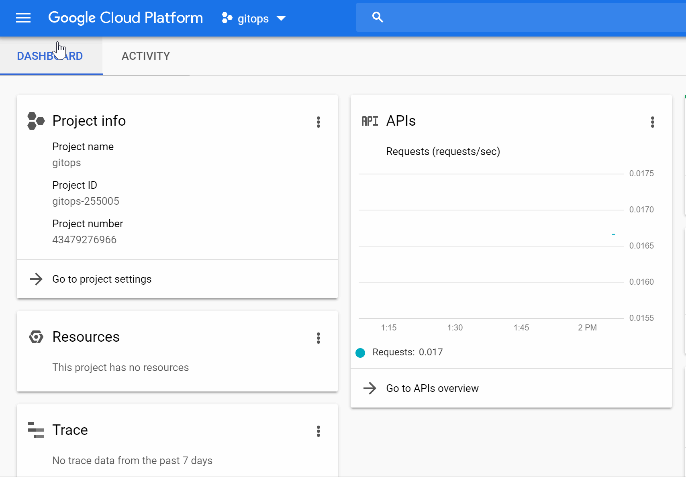
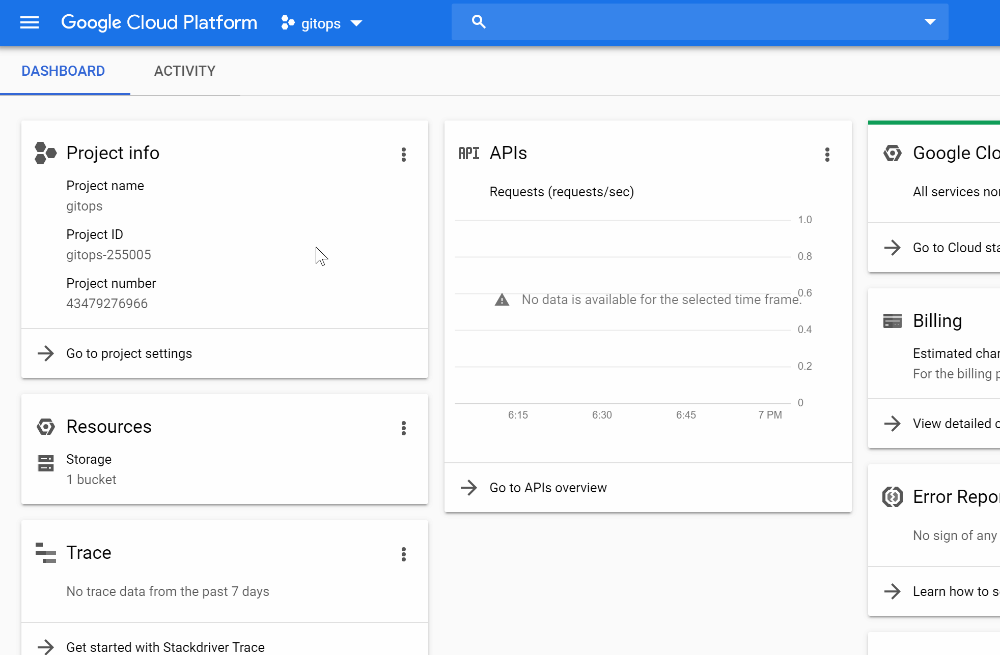
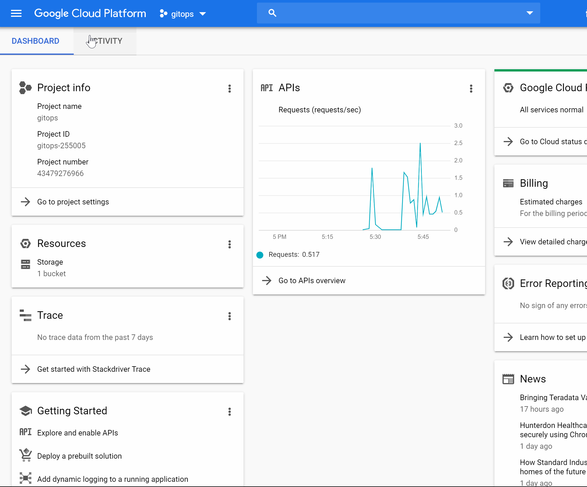

## Getting Started with GitOps using Flux on Google Cloud Platform

This page explains how to set up pull-based GitOps on Google Cloud Platform using Weavework's [Flux](https://github.com/fluxcd/flux).
All code used on this page can be found in full on [GitHub](https://github.com/gitops-tech).

### Setting Up the Google Cloud Project

Either select an existing project or [create a new one](https://console.cloud.google.com/cloud-resource-manager) in the Google Cloud Console.

For this project, you need to enable Google Kubernetes Engine and Google Cloud Build APIs.




### Building Container Images with Google Cloud Build

Google Cloud Build uses the `cloudbuild.yaml` file in the root of the repository to find the steps to execute the build.
Our example project is a small Go application, so first the Go binaries are built.
Then, Google Cloud Build builds the container image, tagges it and pushes it to the Google Container Registry.
You can also find the following `cloudbuild.yaml` file on [GitHub](https://github.com/gitops-tech).

```yaml
steps:
# build the binaries
- name: 'gcr.io/cloud-builders/go'
  args: ['build', '-o', 'hello', 'src/main.go']

# build the container image, tag it and push it to the Google Container Registry of our project
- name: 'gcr.io/cloud-builders/docker'
  args: ['build', 
      '-t', 'gcr.io/$PROJECT_ID/$REPO_NAME:$BRANCH_NAME-$SHORT_SHA',
      '-t', 'gcr.io/$PROJECT_ID/$REPO_NAME:latest',
      '-f', 'Dockerfile', '.']

images:
- 'gcr.io/$PROJECT_ID/$REPO_NAME:$BRANCH_NAME-$SHORT_SHA'
- 'gcr.io/$PROJECT_ID/$REPO_NAME:latest'
```

Next, create a trigger for Google Cloud Build, to execute the build when new commits are pushed to the repository.



Now, whenever the application repository changes, a new container image of the current version of the application is built and pushed to your Google Container Registry.

### Setting up the Kubernetes Cluster

Next, create a Kubernetes cluster in Google Kubernetes Engine.
If you are setting up GitOps for an existing project already using Kubernetes you can skip this step.



Of course, you can also use Infrastructure as Code tools such as Terraform to set up your cluster.

### Adding the Kubernetes Manifests to the Environment Repository

To tell the operator what to actually deploy on the cluster, you have to initially write the Kubernetes manifests.

```yaml
# deployment.yaml
apiVersion: extensions/v1beta1
kind: Deployment
metadata:
  name: example-application
spec:
  replicas: 3
  template:
    metadata:
      labels:
        app: example-application
    spec:
      containers:
      - name: example-application
        image: gcr.io/gitops-255005/example-application:master-f7517f2
        ports:
        - containerPort: 8080
---

# service.yaml
apiVersion: v1
kind: Service
metadata:
  name: example-application
  labels:
    app: example-application
spec:
  type: LoadBalancer
  ports:
  - port: 8080
  selector:
    app: example-application
```

Create these files in your environment repository, commit and push.
However, you don't have to deploy it yourself to your newly created cluster.
The operator will do that in the next step.


### Deploying the Operator

The last thing to do is deploy the Flux operator.
We will set it up, so that the Google Container Registry and the environment repository is observed.
Whenever a new version of the container image is pushed to the registry, the operator will update the manifests in the environment repository with the new version and deploy it to the cluster.

The [Flux Git Repository](https://github.com/fluxcd/flux) comes with Kubernetes manifests for deploying Flux in `deploy/`, so you can simply clone the repository to get started.

```bash
git clone git@github.com:fluxcd/flux.git  
```

Before deploying, Flux needs to know where your environment repository is located.
Find the `--git-url` parameter in `deploy/flux-deployment.yaml` and change it to your Git URL.

```yaml
---
apiVersion: apps/v1
kind: Deployment
spec:
  replicas: 1
  template:
    spec:
      containers:
      - name: flux
        image: docker.io/fluxcd/flux:1.15.0
        
        args:
        - --git-url=git@github.com:gitops-tech/example-environment.git
```

You can now deploy the manifests you just cloned.
This will create an instance of Flux in its own `flux` namespace, that is observing your environment repository on the `master` branch.

```bash
kubectl apply -f .
```

That's it! You now have a running instance of Flux operating your cluster.
After a few seconds, you are able to see, that Flux deployed your application as described in the manifests by using the command line utility [fluxctl](https://docs.fluxcd.io/en/stable/references/fluxctl.html).

```console
$ fluxctl list-workloads --k8s-fwd-ns flux
WORKLOAD           CONTAINER  IMAGE                RELEASE   POLICY
default:[...]/app  app        gcr.io/[...]/app:v1  ready     automated
```

If you don't see the above output, check whether your repository is publicly accessible.
If you're using a private repository, you need to grant Flux access to it.
Using [fluxctl](https://docs.fluxcd.io/en/stable/references/fluxctl.html), you can access the SSH key of Flux with  `fluxctl identity --k8s-fwd-ns flux`.
Allow this SSH key access to your repository and you're good!
